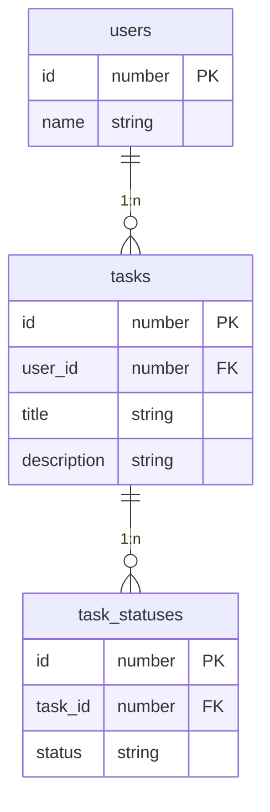

# Links

## Crates

- [tokio](https://github.com/tokio-rs/tokio)
- [hyper](https://github.com/hyperium/hyper)
- [axum](https://github.com/tokio-rs/axum)
- [async-graphql](https://github.com/async-graphql/async-graphql)
- [sea-orm](https://github.com/SeaQL/sea-orm)

## Tutorial

- [Rust Async-GraphQL Example: Caster API](https://github.com/bkonkle/rust-example-caster-api)

# ER diagram

